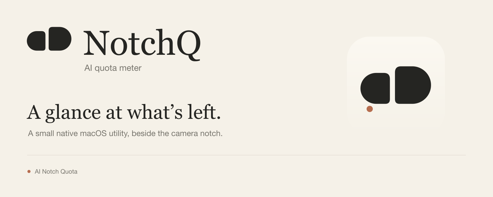

# NotchQ

A small native Mac app that keeps your remaining AI allowance beside the camera notch. **NotchQ** combines *notch* and *quota*: **AI Notch Quota**.

**Unsigned preview:** this release is locally ad-hoc signed, without Developer ID signing or Apple notarization. macOS may block a downloaded copy. Source visibility and GitHub stars do not replace those checks. See [Apple's guidance](https://support.apple.com/en-us/102445). Signing can be added to a later release.

## Install

1. Download the universal DMG from [Releases](https://github.com/Xentiles/NotchQ/releases).
2. Open it and drag **NotchQ** onto **Applications**.
3. Open NotchQ from Applications once. Copying an app does not automatically launch it.
4. Review the first-run Settings window. **Notch position is enabled by default**; **Start at login** is your choice.

No developer tools or terminal commands are needed to run the downloaded app. Open NotchQ again to reach Settings even when all readings are hidden.

## How it works

- Libron percentages in a compact badge: **white for Codex**, **orange for Claude**.
- Only enabled, running providers with a current verified reading appear. Missing or stale readings stay hidden; valid 0% and 100% remain visible.
- Six-point padding measured from visible glyph bounds, with gentle size and fade transitions respecting macOS Reduce Motion.
- Default placement follows macOS-reported unobscured screen areas. A standard menu-bar item is used when no suitable notch area exists.
- Native Settings for provider connections, placement, visibility and optional login startup.

### Usage sources

| Provider | Connection | Update behavior |
| --- | --- | --- |
| Codex | Your installed Codex app or CLI and its existing sign-in | Read-only usage query every 10 seconds while enabled and awake; failures back off. |
| Claude | Optional connection to Claude Code's documented status-line feed | Usage snapshots after Claude Code responses on supported plans; the app checks the local snapshot every 10 seconds. Unchanged timer output does not make old data fresh; snapshots older than three minutes are hidden. |

**Claude Free does not provide a verified remaining-percentage feed in this release.** Its entry stays hidden. Claude Pro/Max usage needs the Claude Code connection, not just a signed-in Claude Desktop window. Connecting backs up and wraps the user's existing status-line command; disconnecting restores the saved status-line object when its command still matches the bridge. Independently changed commands and unrelated top-level settings are preserved; other status-line fields revert to the backup.

NotchQ does not bundle vendor CLIs, call private Claude usage endpoints, extract passwords/cookies, or run model prompts to obtain readings. See [privacy details](PRIVACY.md).

## Compatibility

The universal app contains **Apple silicon and Intel** binaries and targets **macOS 13 or later**. Provider applications have their own system requirements. Users of a CLI without its desktop app can turn off **Show only running apps**.

Placement uses screen geometry rather than model names or a fixed notch width. External displays and Macs without a notch use the standard menu bar. Unreleased hardware and hypothetical future Dynamic Island APIs have not been tested or certified; safe fallback remains available.

## Build

Install Apple's Command Line Tools, then run:

```sh
zsh scripts/build.sh
zsh scripts/test.sh
zsh scripts/package-dmg.sh
```

The app is built in `dist/NotchQ.app`; release images and checksums are written under `releases/`. The shipping app excludes the check-only Swift sources. Tests use local fixtures and do not consume AI quota.

The repository contains application source, its required resources, selected SVG branding masters, essential checks, packaging scripts and user documentation. Concept boards, old versions, development caches and local notes are not part of the repository or DMG.

## Remove

Disconnect Claude Code in Settings first if you enabled its connection. Turn off **Start at login**, quit NotchQ, and move the app from Applications to Trash. You can also remove its entry in macOS **System Settings → General → Login Items**. Optional cached readings and the status-line backup are in `~/Library/Application Support/NotchQ`; delete that folder only after disconnecting.

## License and branding

**All rights reserved.** You may download and run unmodified official release binaries on your own devices. Source reuse, modification or redistribution requires permission; see [LICENSE](LICENSE). Libron has its separate [SIL Open Font License](Resources/Libron-LICENSE.txt).

The selected **Quiet Signal** identity uses clean SVG geometry and outlined lettering. Its larger right node represents the native notch; the smaller left node represents NotchQ. SVG masters are in `Assets/Brand`; PNG and ICNS files are platform derivatives. The brand's clay accent never replaces the provider-specific white/orange percentage colors.
